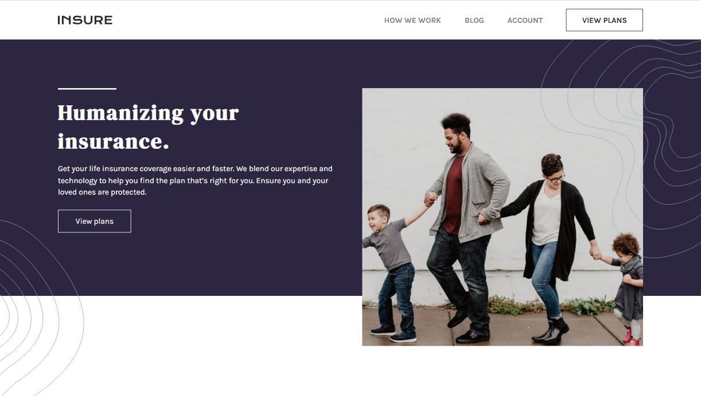

# Insure - Landing Page

Este proyecto es una solución al reto [Insure landing page](https://www.frontendmentor.io/challenges/insure-landing-page-uTU68JV8) de Frontend Mentor. El objetivo es crear una landing page responsiva, moderna y atractiva, utilizando HTML y CSS, siguiendo el diseño proporcionado.

## Tabla de contenidos

- [Descripción general](#descripción-general)
  - [El desafío](#el-desafío)
  - [Captura de pantalla](#captura-de-pantalla)
  - [Links](#links)
- [Mi proceso](#mi-proceso)
  - [Tecnologías utilizadas](#tecnologías-utilizadas)
  - [Lo que aprendí](#lo-que-aprendí)
- [Autor](#autor)
- [Agradecimientos](#agradecimientos)


## Descripción general

### El desafío

Los usuarios deberían poder:

- Ver el diseño óptimo del sitio según el tamaño de la pantalla de su dispositivo.
- Ver los estados al pasar el cursor sobre todos los elementos interactivos de la página, incluyendo los iconos de redes sociales.

### Captura de pantalla



### Links

- [Solución](https://www.frontendmentor.io/solutions/insure-landing-page-with-flexbox-LeQhGIui91)
- [URL del sitio](https://oliver-92.github.io/Insure-landing-page/)

## Mi proceso

### Tecnologías utilizadas

- HTML5
- CSS3
- Flexbox
- Metodología mobile-first

### Lo que aprendí

Durante el desarrollo de este proyecto, reforcé mis conocimientos sobre Flexbox, diseño responsivo y manipulación de iconos SVG con JavaScript para mejorar la experiencia de usuario. También trabajé en mantener una estructura clara del HTML antes de aplicar estilos.

Ejemplo de código que me gustó cómo quedó:

```js
// Cambia el icono de las redes sociales en el footer al pasar el mouse (hover)
document.addEventListener('DOMContentLoaded', function () {
  const iconMap = {
    'icon-facebook.svg': 'icon-facebook-hover.svg',
    'icon-twitter.svg': 'icon-twitter-hover.svg',
    'icon-pinterest.svg': 'icon-pinterest-hover.svg',
    'icon-instagram.svg': 'icon-instagram-hover.svg'
  };
  const footerIcons = document.querySelectorAll('.footer__icon');
  footerIcons.forEach(function (icon) {
    const originalSrc = icon.getAttribute('src');
    const filename = originalSrc.split('/').pop();
    const hoverSrc = originalSrc.replace(filename, iconMap[filename]);
    icon.addEventListener('mouseenter', function () {
      if (iconMap[filename]) {
        icon.setAttribute('src', hoverSrc);
      }
    });
    icon.addEventListener('mouseleave', function () {
      icon.setAttribute('src', originalSrc);
    });
  });
});
```

## Autor

- Website - [Ezequiel Oliver](https://oliver-92.github.io/Portafolio/)
- Frontend Mentor - [@Oliver-92](https://www.frontendmentor.io/profile/Oliver-92)

## Agradecimientos

Gracias a la comunidad de Frontend Mentor por el desafío y al autor del diseño original por el excelente layout de práctica.
